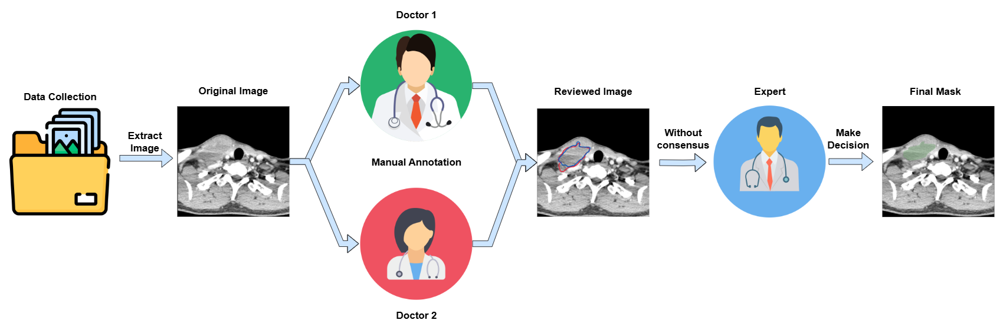

# AbscessHeNe
### AbscessHeNe: A Benchmark Dataset for Abscess Segmentation in Head and Neck CT Imaging

## Overview


## Download Dataset:
Link to download our dataset at [Drive](https://drive.google.com/drive/folders/1_vLDHuEjtUMyLOpkKBugvrN9jHO5YQTM?usp=sharing)

AbscessHeNe Dataset is structured as follows:

```
AbscessHeNe
├── train_images
|   ├── 1a87a4ac_slice174.png
|   ├── 1a87a4ac_slice175.png
|   ├── ...
|   ├── fbe02ced_slice796.png
|   └── fbe02ced_slice797.png
├── train_masks
|   ├── 1a87a4ac_slice174.png
|   ├── 1a87a4ac_slice175.png
|   ├── ...
|   ├── fbe02ced_slice796.png
|   └── fbe02ced_slice797.png
├── test_images
|   ├── 3ef6c51e_slice155.png
|   ├── 3ef6c51e_slice156.png
|   ├── ...
|   ├── f569c463_slice355.png
|   └── f569c463_slice356.png
├── test_masks
|   ├── 3ef6c51e_slice155.png
|   ├── 3ef6c51e_slice156.png
|   ├── ...
|   ├── f569c463_slice355.png
|   └── f569c463_slice356.png
├── abscesshene_train.csv
├── abscesshene_test.csv
└── dataset.json
```

**Key Features:**
- `train_images`: Contains training CT slices in PNG format
- `train_masks`: Corresponding segmentation masks for training
- `test_images`: Test set CT slices
- `test_masks`: Corresponding test set masks
- CSV files contain clinical metadata
- `dataset.json` provides comprehensive dataset statistics

```bibtex
 @article{abscesshene,
  title={Toward Content-based Indexing and Retrieval of Head and Neck CT with Abscess Segmentation},
  author={Thao Thi Phuong Dao, Tan-Cong Nguyen, Trong-Le Do, Truong Hoang Viet, Nguyen Chi Thanh, Huynh Nguyen Thuan, Do Vo Cong Nguyen, Minh-Khoi Pham, Mai-Khiem Tran, Viet-Tham Huynh, Trong-Thuan Nguyen, Trung-Nghia Le, Vo Thanh Toan, Tam V. Nguyen, Minh-Triet Tran, Thanh Dinh Le},
  Conference={the Special Session "MAICBR: Multimedia AI in Modern CB Retrieval: Challenges and Applications" in the 2025 IEEE International Conference on Content-Based Multimedia Indexing (IEEE CBMI) conference},
  year={2025}
}
```
