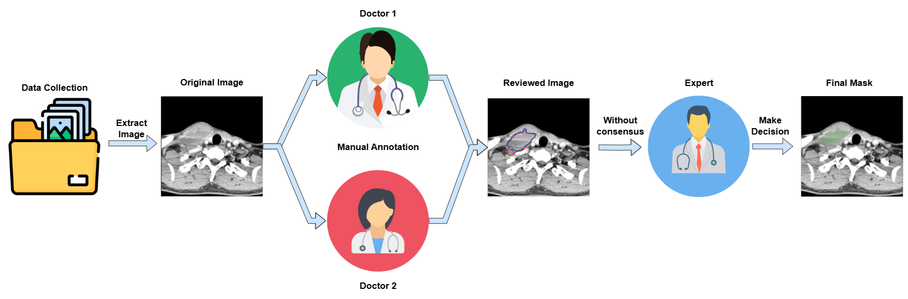

# AbscessHeNe
### AbscessHeNe: A Benchmark Dataset for Abscess Segmentation in Head and Neck CT Imaging

## Overview


## Download Dataset:
Link to download our dataset at [Drive](https://drive.google.com/drive/folders/1_vLDHuEjtUMyLOpkKBugvrN9jHO5YQTM?usp=sharing)

AbscessHeNe Dataset is structured as follows:

```
AbscessHeNe
├── train_images
|   ├── 1a87a4ac_slice174.png
|   ├── 1a87a4ac_slice175.png
|   ├── ...
|   ├── fbe02ced_slice796.png
|   └── fbe02ced_slice797.png
├── train_masks
|   ├── 1a87a4ac_slice174.png
|   ├── 1a87a4ac_slice175.png
|   ├── ...
|   ├── fbe02ced_slice796.png
|   └── fbe02ced_slice797.png
├── test_images
|   ├── 3ef6c51e_slice155.png
|   ├── 3ef6c51e_slice156.png
|   ├── ...
|   ├── f569c463_slice355.png
|   └── f569c463_slice356.png
├── test_masks
|   ├── 3ef6c51e_slice155.png
|   ├── 3ef6c51e_slice156.png
|   ├── ...
|   ├── f569c463_slice355.png
|   └── f569c463_slice356.png
├── abscesshene_train.csv
└── abscesshene_test.csv
```

**Key Features:**
- `train_images`: Contains training CT slices in PNG format
- `train_masks`: Corresponding segmentation masks for training
- `test_images`: Test set CT slices
- `test_masks`: Corresponding test set masks
- CSV files contain clinical metadata

```bibtex
@article{dao2025toward,
  title={Toward Content-based Indexing and Retrieval of Head and Neck CT with Abscess Segmentation},
  author={Dao, Thao Thi Phuong and Nguyen, Tan-Cong and Do, Trong-Le and Viet, Truong Hoang and Thanh, Nguyen Chi and Thuan, Huynh Nguyen and Nguyen, Do Vo Cong and Pham, Minh-Khoi and Tran, Mai-Khiem and Huynh, Viet-Tham and others},
  journal={arXiv preprint arXiv:2512.01589},
  year={2025}
}
```
